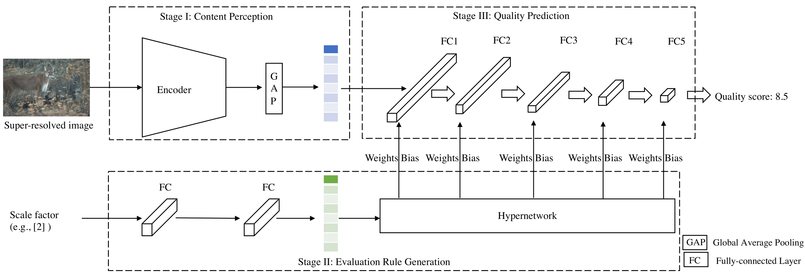

## Scale Guided Hypernetwork for Blind Super-Resolution Image Quality Assessment

[Paper](https://arxiv.org/abs/2306.02398)




## Directory Specification
```
-log\ save training log
-nets\ define iqa model 
-save\ save model 
-datasets.py define datasets 
-datasets_deepsrq.py define datasets for deepsrq
-engine.py train engine
-train_test_IQA setup training and test 
```

## TODO
- [x] ~~Code release~~
- [ ] update datasets


## Train and Test
```
python train_test_IQA.py --dataset xxx --netFile xxx --gpuid x --batch_size 64
```
Some mandatory options:
* `--dataset`: string, Training and testing dataset, support datasets: 'CVIU' | 'QADS'| 'Waterloo'.
* `--netFile`: string, IQA model, support models: 'DBCNN' | 'HyperIQA' | 'CNNIQA' | 'Resnet50' | 'JCSAN' | 'DeepSRQ'.
* `--gpuid`: int, gpu device 
* `--batch_size`: int, Batch size, 64.

### Acknowledgement
This project is based on [HyperIQA](https://github.com/SSL92/hyperIQA). Thanks for the awesome work.

## Citation
Please cite the following paper if you use this repository in your reseach.
```
@article{fu2023scale,
  title={Scale Guided Hypernetwork for Blind Super-Resolution Image Quality Assessment},
  author={Fu, Jun},
  journal={arXiv preprint arXiv:2306.02398},
  year={2023}
}
```